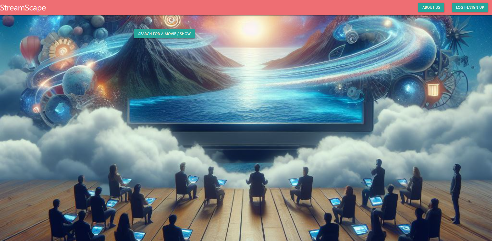

# StreamScape

## Description.
    StreamScape is a search tool that you can use to check if your favorite movie/show is streaming and on what service. Simply enter the name of the show or movie you are looking for into the search bar and our app will show you if it's streaming and where. If you'd like to create a watchlist, you can sign up for an account and add your favorites to it.

## Built With
    - Javascript
    - Streaming Availability API
    - Materialize.
    - CSS.
    - Handlebars
    - GSAP
    - Node.js

## Project Link
    https://github.com/m-beke/StreamScape

## Acknowledgments
    Special thanks to our instructors John and Mary for their patience and guidance!
